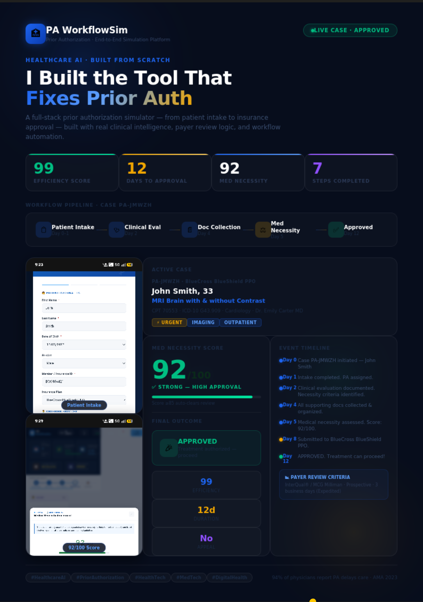

🚀 Day 26 of #60DaysClaudeAIChallenge

🏥 I built PA WorkflowSim — because Prior Authorization is broken, and someone had to fix it.
94% of physicians say PA delays care.
33% report patients had serious adverse events because of it.
Average turnaround: 2–14 business days. That's unacceptable.
So I built a full-stack Prior Authorization simulation platform from scratch — covering every real step a coordinator faces daily.
What the simulation covers:
📋 Patient Intake → 🩺 Clinical Evaluation → 📄 Document Collection → ⚖️ Medical Necessity Review → 🏛 Payer Clinical Review → ✅ Final Decision
Real case result:
Patient: John Smith | Brain MRI w/ & w/o Contrast
Insurance: BlueCross BlueShield PPO (Expedited)
Medical Necessity Score: 92/100 (Auto-clears clinical review)
Payer Criteria: InterQual® / MCG Milliman
Final Decision: APPROVED ✅
Efficiency Score: 99/100 | Total: 12 days | 7 steps
The platform teaches real clinical codes (CPT, ICD-10), payer review logic, InterQual® criteria, ACA §2719 compliance, and first-pass approval strategies.
If you're in HealthTech, MedTech, or Healthcare AI — I'd love to connect and talk shop. 🚀

Anil Bajpai | ABTalksOnAI | Anthropic 

#60DayClaudeChallenge #ClaudeChallenge #ABTalks #ClaudeAI #ArtificialIntelligence #PromptEngineering #LearningInPublic #BuildInPublic #Productivity #AI #FutureOfWork
#HealthcareAI #PriorAuthorization #HealthTech #MedTech #DigitalHealth #HealthcareInnovation #BuildInPublic

Screenshot 

