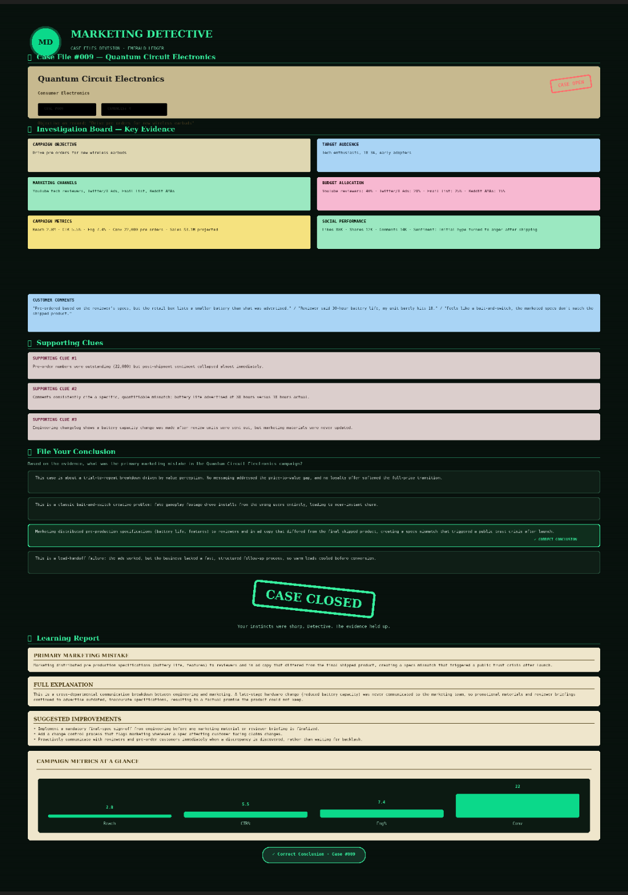

🚀 Day 34 of #60DaysClaudeAIChallenge

Built something fun this week: "Marketing Detective" 🕵️‍♂️
What if learning marketing analytics felt like solving a case file instead of reading a dashboard?
I designed and built a fully interactive detective-game web app where every "case" is a real-feeling marketing campaign gone wrong — and your job is to investigate the evidence and diagnose why.
Here's how it plays out:
📁 Case Assignment — You're handed a case file (like "Quantum Circuit Electronics," a wireless earbuds pre-order campaign) with the objective, industry, and a hook: something went sideways.
🔍 Investigation Board — A corkboard of draggable sticky-note evidence: campaign objective, target audience, channels, budget split, campaign metrics, customer comments, and social performance — all pinned and ready to inspect.
📌 Evidence Locker — Drag the clues that matter into your locker to build your theory before committing to an answer.
🗂 File Your Conclusion — Choose the real root cause from a set of plausible-sounding decoys. (In this case: a late-stage battery spec change that never made it from engineering to marketing — creating a public trust crisis after launch.)
🎬 Case Closed — An animated stamp reveals whether your instincts were right.
📖 Learning Report — A full breakdown: the mistake, the explanation, actionable improvements, and an animated metrics chart (reach, CTR, engagement, conversions).
Every replay loads a new randomized case — from influencer disclosure failures to pricing missteps to sales/marketing handoff breakdowns — so it doubles as a genuinely useful training tool for marketing teams to practice diagnosing campaign failures.
Built entirely as a single-file, dependency-free HTML/CSS/JS app — no backend, no frameworks — with a dark "Emerald Ledger" detective aesthetic: corkboards, paper textures, glowing accents, and push-pin evidence cards.
Sometimes the best way to teach a skill is to turn it into a mystery. 🧩

Anil Bajpai | ABTalksOnAI | Anthropic 

#60DayClaudeChallenge #ClaudeChallenge #ABTalks #ClaudeAI #ArtificialIntelligence #PromptEngineering #LearningInPublic #BuildInPublic #Productivity #AI #FutureOfWork
#UXDesign #MarketingAnalytics #ProductDesign #Gamification #WebDevelopment #InstructionalDesign

Screenshot 

