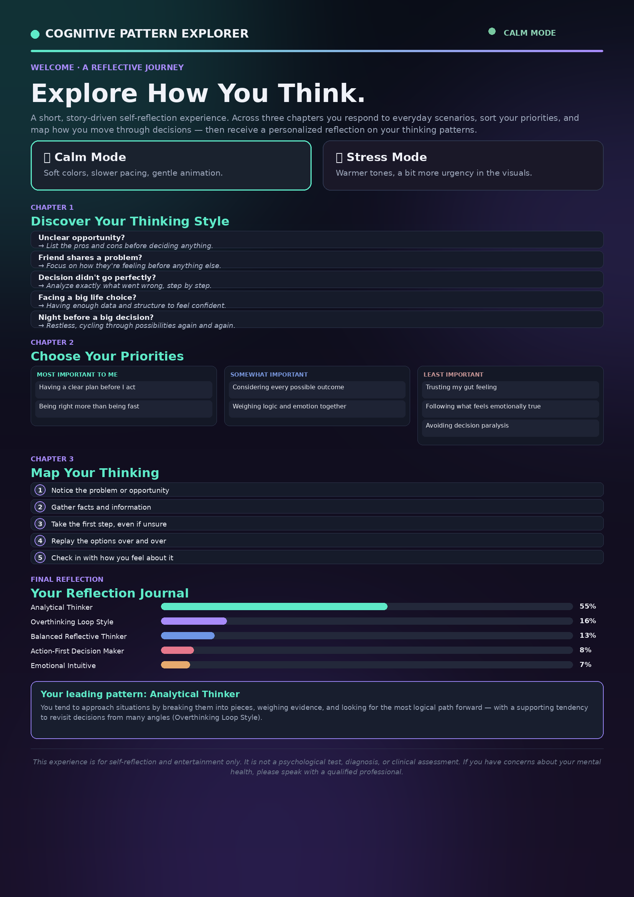

🚀 Day 36 of #60DaysClaudeAIChallenge

Cognitive Pattern Explorer — An Interactive Self-Reflection Journey
Built a narrative-driven web experience that helps users understand their own decision-making style through story, not surveys.
How it works:
🎭 Two moods: Users choose Calm Mode or Stress Mode, shifting the visual pacing and tone of the entire journey
📖 Chapter 1 — Discover Your Thinking Style: Five relatable scenarios (a friend in crisis, a big life choice, a decision that didn't pan out) capture instinctive responses rather than abstract self-ratings
🗂️ Chapter 2 — Choose Your Priorities: A drag-and-drop card sort lets users rank what they value most when deciding — from "having a clear plan" to "trusting my gut"
🔢 Chapter 3 — Map Your Thinking: Users sequence their natural decision-making steps, from noticing a problem to taking action
📊 Reflection Journal: A personalized breakdown (e.g., "55% Analytical Thinker, 16% Overthinking Loop Style") with a free-write journal prompt to close the loop
Design principles I focused on:
Framed as reflection, not diagnosis — clear disclaimers throughout that this isn't a clinical tool
Accessible interactions: drag-and-drop paired with keyboard/Enter-key alternatives
Calm gradient UI (teal → purple) that reinforces the introspective tone
Progress indicators at every step so the journey never feels open-ended
It's a small case study in using game-like mechanics to make self-awareness feel exploratory rather than clinical.

Anil Bajpai | ABTalksOnAI | Anthropic 

#60DayClaudeChallenge #ClaudeChallenge #ABTalks #ClaudeAI #ArtificialIntelligence #PromptEngineering #LearningInPublic #BuildInPublic #Productivity #AI #FutureOfWork
#UXDesign #ProductDesign #InteractionDesign #WebApp #SelfReflection

Screenshot 

