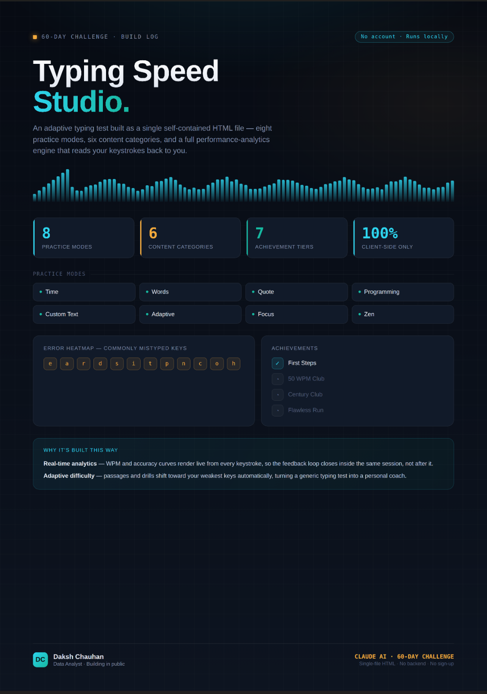

🚀 Day 38 of #60DaysClaudeAIChallenge

Built "Typing Speed Studio" — a premium adaptive typing test, packed into a single self-contained HTML file. No backend. No sign-up. No dependencies. Just open it and type.
What's inside:
⌨️ 8 practice modes — Time, Words, Quote, Programming, Custom Text, Adaptive, Focus, and Zen
📚 6 content categories spanning general, academic, business, medical, legal, and creative text
📊 Live performance analytics — WPM and accuracy render in real time from every keystroke
🎯 Adaptive difficulty — the app quietly tracks your weakest keys and steers future drills toward them
🏆 7 achievement tiers to gamify progress, from "First Steps" to "Century Club"
The idea  at a time, in public, as part of my 60-day challenge with Claude.

Anil Bajpai | ABTalksOnAI | Anthropic 

#60DayClaudeChallenge #ClaudeChallenge #ABTalks #ClaudeAI #ArtificialIntelligence #PromptEngineering #LearningInPublic #BuildInPublic #Productivity #AI #FutureOfWork
#buildinpublic #ClaudeAI #DataAnalyst #WebDev #60DayChallenge #IndieHacker #FrontendDesign

Screenshot 

