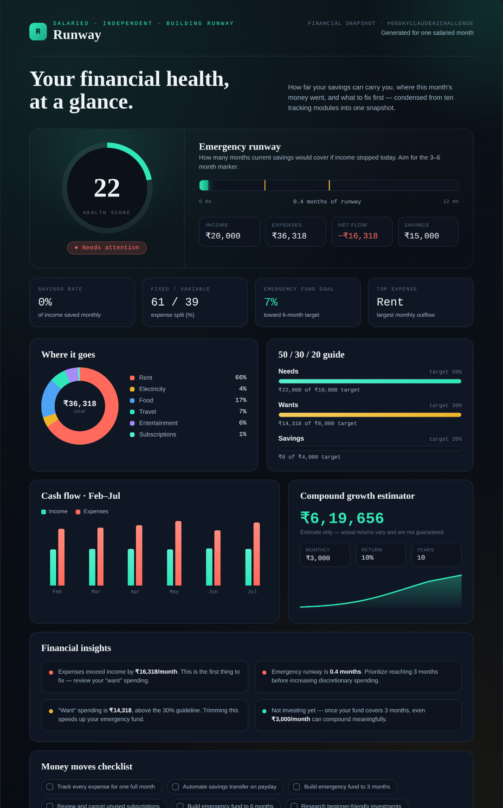

🚀  Day 42 of #60DayClaudeAIChallenge: Runway — a financial command center that doesn't sugarcoat your numbers 🛫

Built a 10-module personal finance dashboard that tracks the full picture: income sources, expense logging (needs/wants tagging), 50/30/20 budget benchmarking, cash flow trends, emergency fund tracking, a compound growth estimator, a what-if simulator, and auto-generated financial insights — all wrapped up in a printable monthly report.
The centerpiece is the Health Score — a single number (backed by an "emergency runway" visual) that tells you in seconds whether you're in trouble or in control. No fluff, no vanity metrics.
Fed it sample numbers and it immediately flagged: expenses outpacing income by ₹16,318/month, "want" spending 2.4x over target, and an emergency fund that would last 0.4 months. Uncomfortable? Yes. Useful? Also yes. That's the point — a tool that tells you the truth before it tells you what to do about it.
Fully client-side, dark navy glassmorphism UI, built solo with Claude in a single sitting.

Anil Bajpai | ABTalksOnAI | Anthropic 

#60DayClaudeChallenge #ClaudeChallenge #ABTalks #ClaudeAI #ArtificialIntelligence #PromptEngineering #LearningInPublic #BuildInPublic #Productivity #AI #FutureOfWork
#BuildInPublic #ClaudeAI #FinTech #PersonalFinance #DataAnalyst #IndieHacker

Screenshot 

