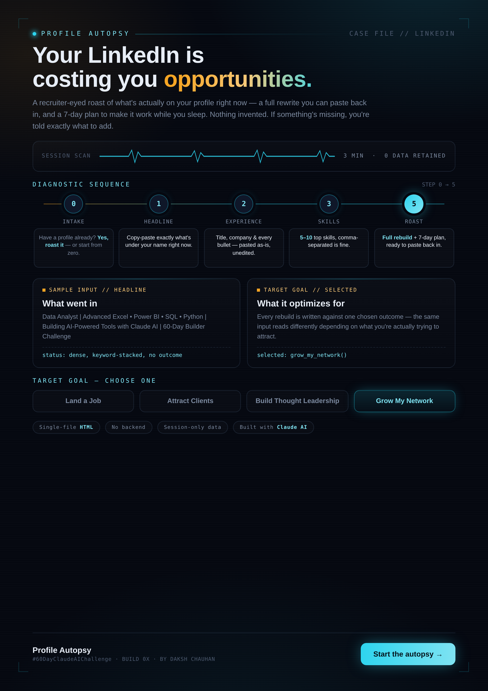

🚀  Day 44 of #60DayClaudeAIChallenge

I built a tool that roasts your LinkedIn profile before a recruiter has to.
Most people don't lose opportunities because they're underqualified. They lose them because their LinkedIn reads like a resume nobody proofread.
So I built Profile Autopsy — a single-file HTML app (no backend, nothing stored) that:
→ Takes your current headline, experience, and skills exactly as they are
→ Roasts what's actually wrong with them — no sugarcoating
→ Rebuilds a full profile you can paste straight back in
→ Hands you a 7-day plan to make it work while you sleep
You pick your goal — job hunting, landing clients, building thought leadership, or growing your network — and the rewrite adapts to that outcome. 3 minutes in, nothing invented, nothing left vague. If something's missing, it tells you exactly what to add instead of making it up.
Built entirely with Claude AI. Zero backend. Your data never leaves the session except to generate the rebuild.
This is the pattern I keep coming back to in this challenge: the best tools don't add features, they remove excuses.
Try it, break it, tell me what it got wrong about your profile 👇

Anil Bajpai | ABTalksOnAI | Anthropic 

#60DayClaudeChallenge #ClaudeChallenge #ABTalks #ClaudeAI #ArtificialIntelligence #PromptEngineering #LearningInPublic #BuildInPublic #Productivity #AI #FutureOfWork
#BuildInPublic #ClaudeAI #LinkedInTips #CareerGrowth #AITools #DataAnalyst

Screenshot 

