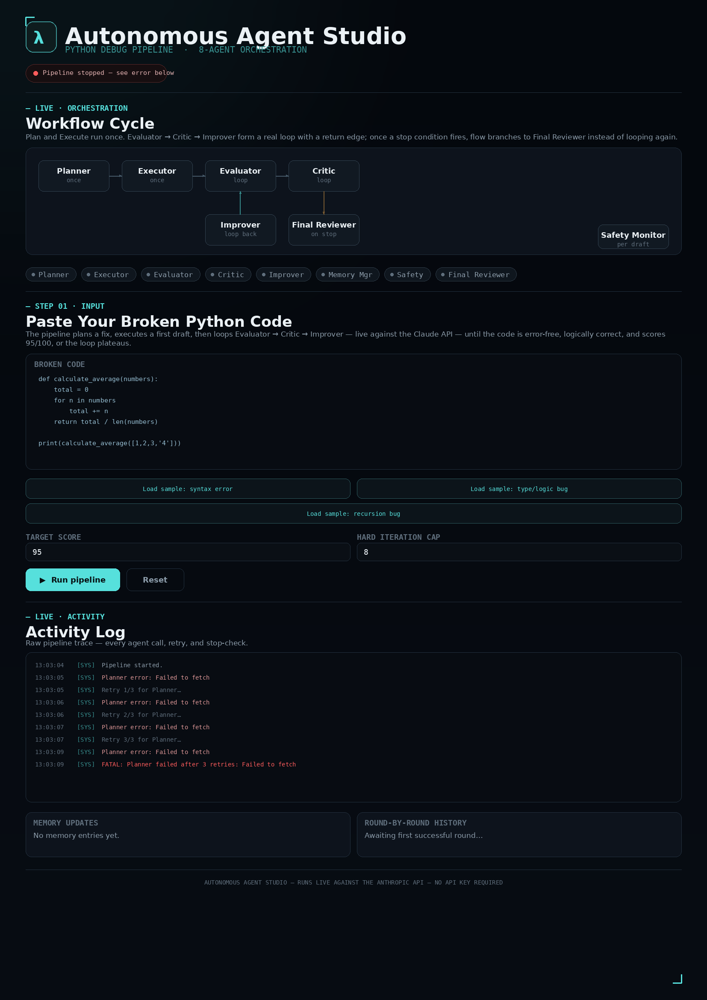

🚀  Day 46 of #60DayClaudeAIChallenge

Built something fun this week: an 8-agent AI orchestration pipeline that debugs Python code autonomously.
Paste in broken code, and a chain of specialized agents — Planner → Executor → Evaluator ⇄ Critic ⇄ Improver, with a Safety Monitor and Final Reviewer watching every draft — loops against the Claude API until the fix is clean, logically correct, and scores 95/100 (or the loop plateaus, whichever comes first).
The whole thing runs live, no shortcuts: real retries, real evaluation rounds, real memory carried forward between iterations to avoid repeating mistakes.
It's a small experiment in what "agentic" actually means beyond the buzzword — not one model guessing at a fix, but a team of narrow roles checking each other's work.

Anil Bajpai | ABTalksOnAI | Anthropic 

#60DayClaudeChallenge #ClaudeChallenge #ABTalks #ClaudeAI #ArtificialIntelligence #PromptEngineering #LearningInPublic #BuildInPublic #Productivity #AI #FutureOfWork

#AI #Agents #ClaudeAPI #SoftwareEngineering #BuildInPublic #LLM #AIagents

Screenshot 

