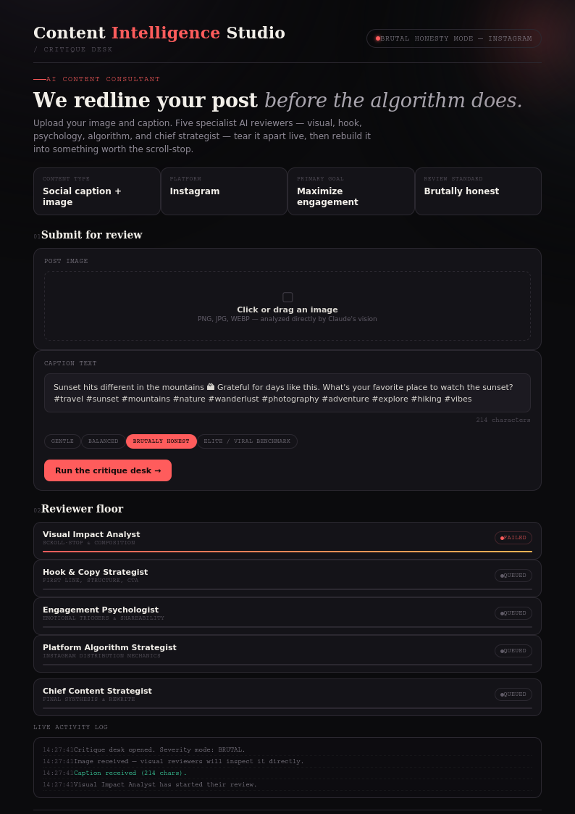

🚀  Day 47 of #60DayClaudeAIChallenge

Spent the weekend building something I've wanted for a while: an AI-powered "critique desk" for content, not a content generator.
Content Intelligence Studio doesn't write your caption for you — it puts your actual post (image + copy) in front of five specialist AI reviewers who each attack it from a different angle:
→ A Visual Impact Analyst who judges scroll-stop power and composition
→ A Hook & Copy Strategist who rips apart your first line
→ An Engagement Psychologist who checks if you've actually earned a comment
→ A Platform Algorithm Strategist who thinks in distribution mechanics, not vibes
→ A Chief Strategist who synthesizes all four into one verdict — score, redlined rewrite, alt hooks, and a publishing checklist
Every score and sentence you see is generated live by Claude — nothing templated, nothing hardcoded. Set it to "brutally honest" mode and it will tell you exactly why your sunset photo with #wanderlust #vibes isn't going anywhere.
Built as a single self-contained web app with a live reviewer floor, activity log, and before/after diff view — because feedback is more useful when you can watch the reasoning happen, not just read a final grade.
Sometimes the most valuable AI tool isn't the one that writes for you — it's the one that tells you the truth before you hit publish.

Anil Bajpai | ABTalksOnAI | Anthropic 

#60DayClaudeChallenge #ClaudeChallenge #ABTalks #ClaudeAI #ArtificialIntelligence #PromptEngineering #LearningInPublic #BuildInPublic #Productivity #AI #FutureOfWork
#AI #ContentStrategy #BuildInPublic #ProductDesign #Claude

Screenshot 

