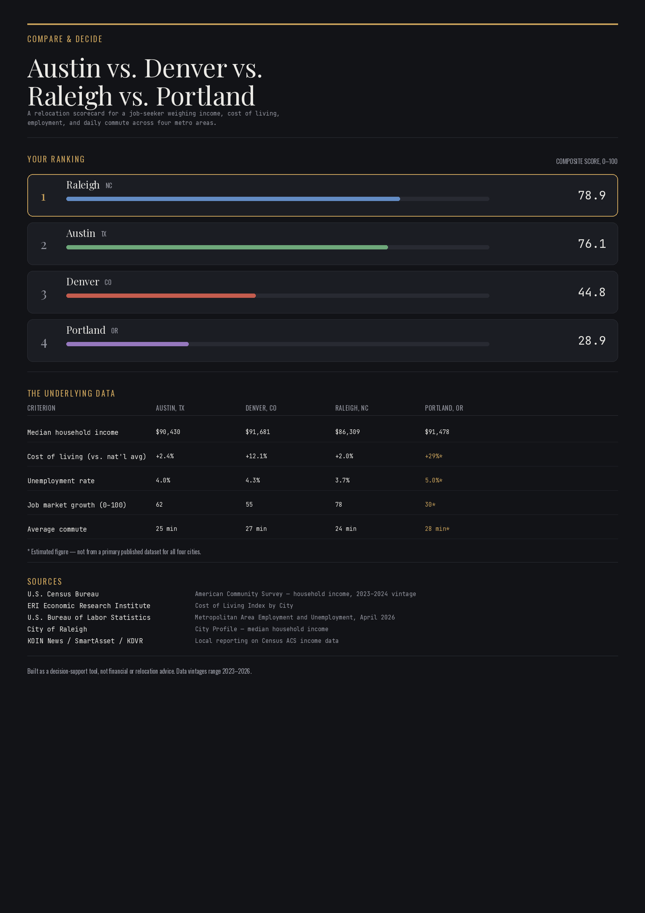

🚀  Day 48 of #60DayClaudeAIChallenge
🌆💰 THE GREAT RELOCATION SHOWDOWN: 4 Cities, 1 Winner, Zero Mercy 🏆
📊 THE VERDICT IS IN — we crunched income, cost of living, jobs, and commute time into one brutal composite score. Spoiler: the city with the fattest paycheck did NOT win. 👀
🥇 RALEIGH, NC — 78.9/100
The quiet underdog just took the crown. 💵 Lower income ($86,309) but who cares when unemployment sits at a razor-thin 3.7% ✅ and your commute is a breezy 24 minutes 🚗💨. Proof that a smaller number on the paycheck ≠ a smaller life.
🥈 AUSTIN, TX — 76.1/100
Texas keeps it tight. 🤠 Solid income ($90,430), cost of living barely nudges above average (+2.4% 📈), and jobs are growing at a healthy 62/100 clip. The safe, steady pick.
🥉 DENVER, CO — 44.8/100
🏔️ Big mountain views, bigger price tag. Income looks great on paper ($91,681) until you realize cost of living is +12.1% above the national average 😬. The Rockies giveth, the rent taketh away.
😵 PORTLAND, OR — 28.9/100
Last place, and it's not close. Income ($91,478) looks competitive… until an estimated +29% cost of living 🔥 quietly torches the entire advantage. Job growth stalls at just ~30/100 📉. Beautiful city, brutal math.
⚡ THE BIG TAKEAWAY ⚡
💡 A high salary means nothing if your city eats it alive. Raleigh and Austin prove that balance beats bragging rights every single time. 🎯
📍 Numbers marked with ⭐ are estimated — screenshots got cut off, so send the real figures and we'll lock it in!

Anil Bajpai | ABTalksOnAI | Anthropic 

#60DayClaudeChallenge #ClaudeChallenge #ABTalks #ClaudeAI #ArtificialIntelligence #PromptEngineering #LearningInPublic #BuildInPublic #Productivity #AI #FutureOfWork

Screenshot 

