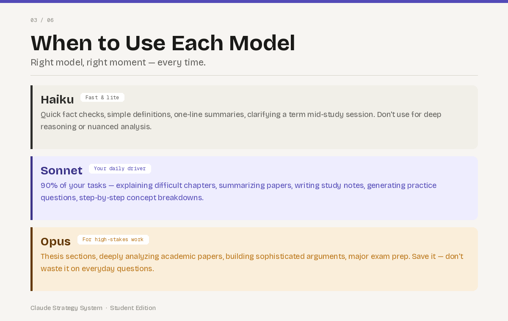
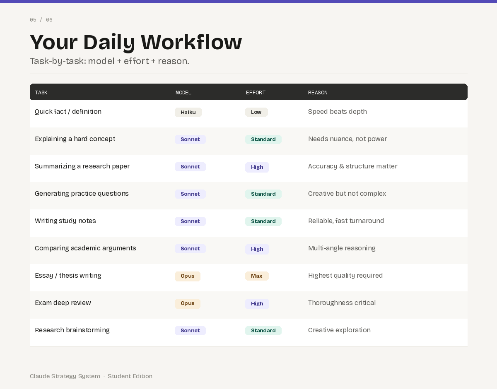
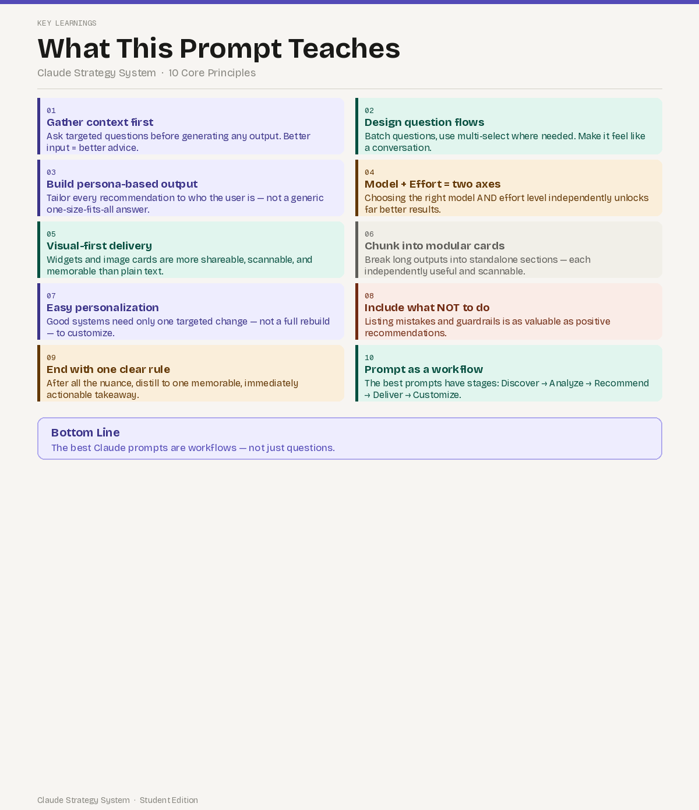

Reason:
It provides the best balance of speed, accuracy, reasoning quality, and productivity for coding, learning, debugging, and project development.

---

## Screenshots

### Personalized Claude Usage Strategy

### Key Learning 

---

## Conclusion

This task helped me understand the importance of selecting the right Claude model and reasoning effort level. By matching the model and effort with the complexity of a task, I can improve productivity, save resources, and achieve better results while learning and building projects.
