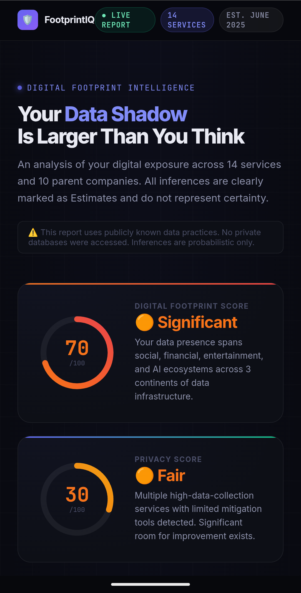
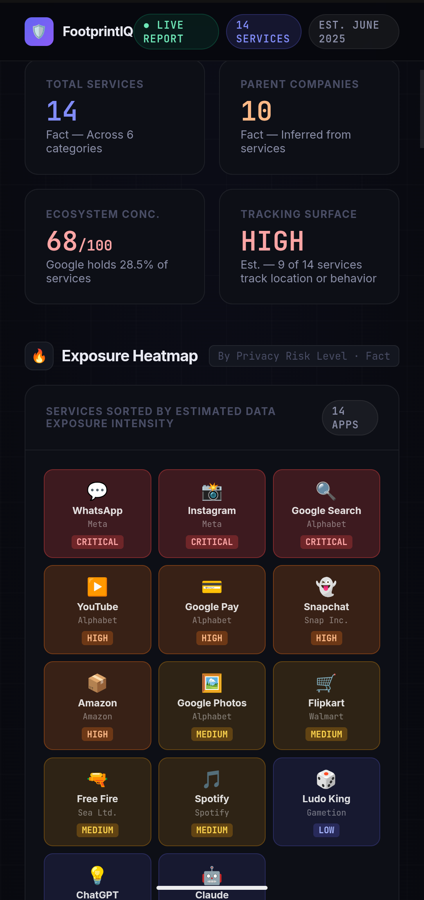
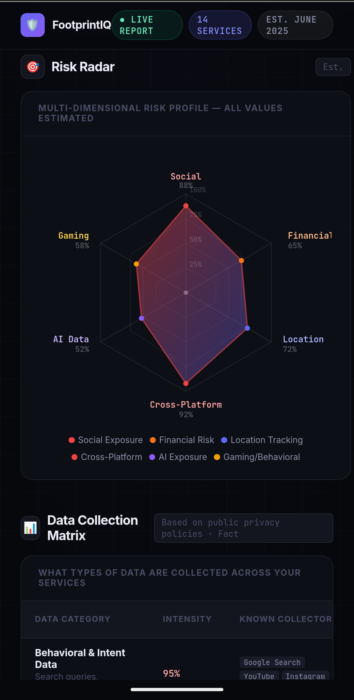
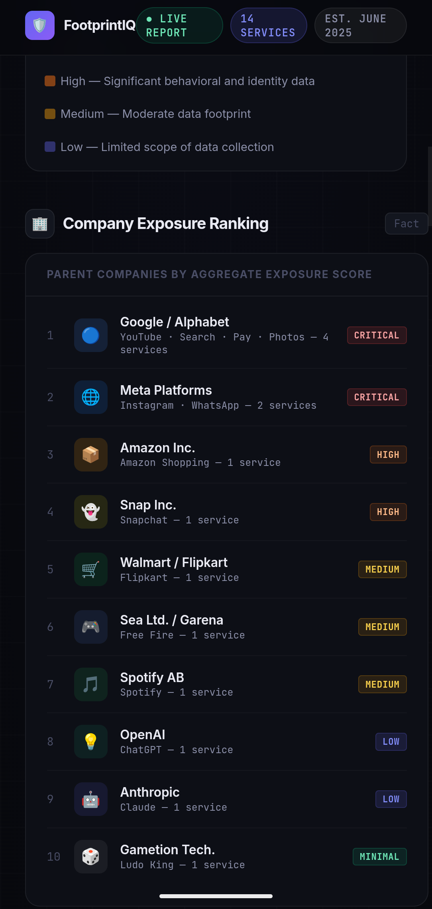
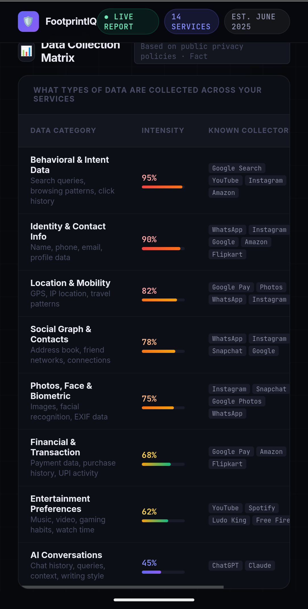
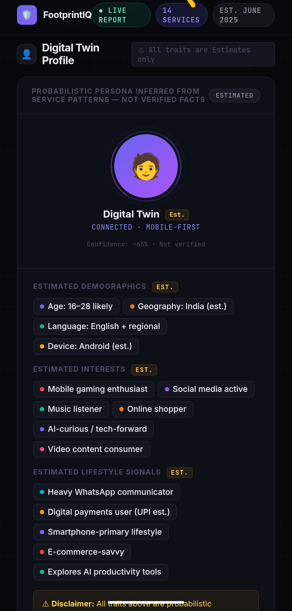
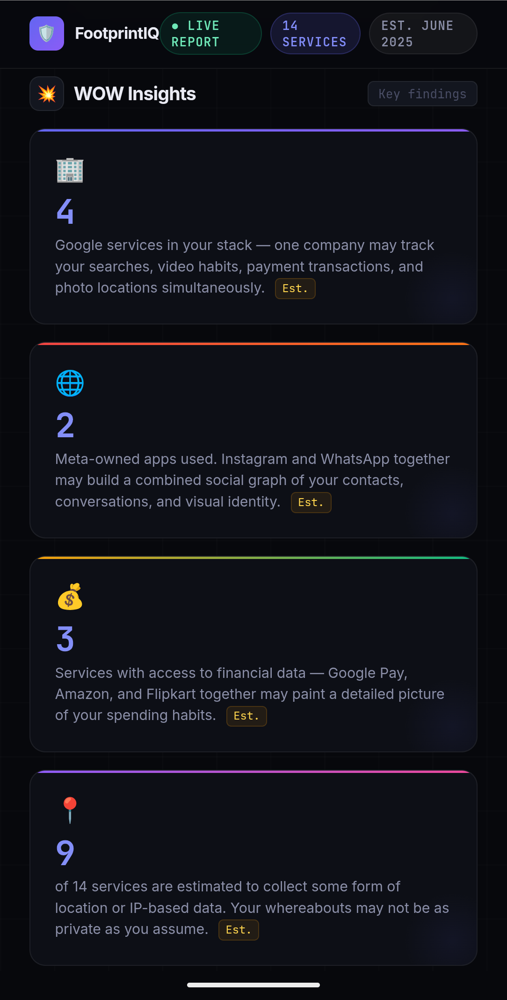
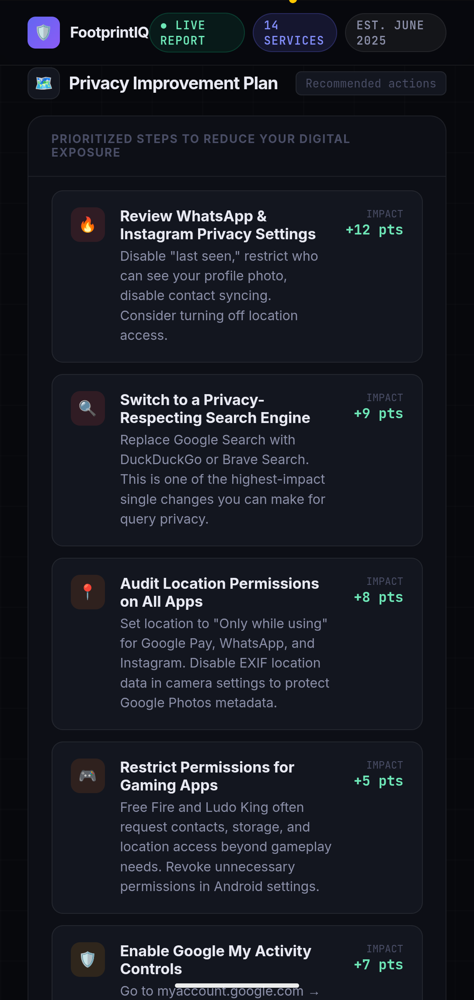

🚀 Day 21 of #60DaysClaudeAIChallenge

🛡️ Built a Personal Privacy Intelligence Dashboard — and what I found was eye-opening.
I mapped my entire digital footprint across 14 apps and 10 parent companies, then visualized it as a premium cybersecurity-style dashboard.
What it includes:
— Digital Footprint Score & Privacy Score (0–100)
— Live Exposure Heatmap across all services
— Company Exposure Ranking (spoiler: Google holds 28.5% of my stack)
— Risk Radar across 6 threat dimensions
— Data Collection Matrix by category
— A Digital Twin Profile inferred from usage patterns
— Interactive Privacy Simulator — toggle services off and watch your score improve in real time
Built with pure HTML, CSS & vanilla JS. No frameworks. No external libraries. Inspired by the design language of Stripe, Linear, and Apple's Privacy Report.
The biggest takeaway? Most people don't realize how much of their data sits with just 2–3 companies simultaneously.
Your search history, payment data, photos, contacts, and conversations may all flow to the same handful of corporations.
Privacy isn't about paranoia — it's about awareness. 🔍
Anil Bajpai  |ABTalksOnAI |Anthropic 

Anthropic Anil Bajpai ABTalksOnAI
#60DayClaudeChallenge #ClaudeChallenge #ABTalks #ClaudeAI #ArtificialIntelligence #PromptEngineering #LearningInPublic #BuildInPublic #Productivity #AI #FutureOfWork

#Privacy #CyberSecurity #DataPrivacy #WebDesign #FrontendDevelopment #BuiltWithHTML #DigitalFootprint #OpenSource

Screenshot 

