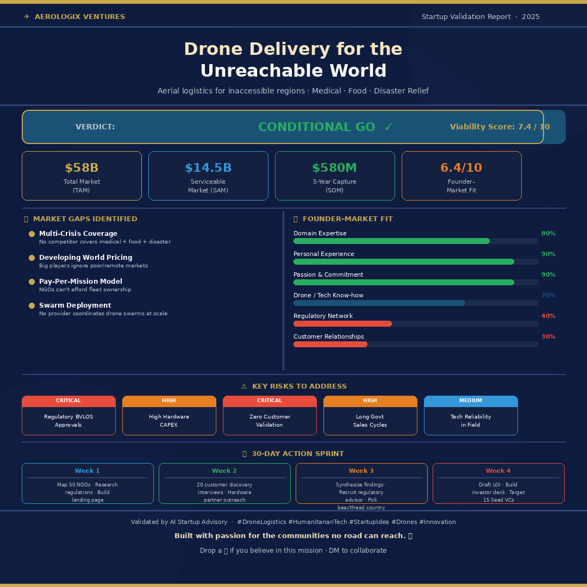

🚀 Day 22 of #60DaysClaudeAIChallenge

🚁 I'm building something that could save lives — and I need your help to validate it.
Every year, millions of people are cut off from medicine, food, and emergency supplies — not because they don't exist, but because no vehicle can reach them.
Flooded roads. Collapsed bridges. Mountain terrain. Conflict zones.
We're solving this with autonomous aerial delivery drones — bringing critical resources to the communities the world has forgotten.
Here's what the market data says:
✅ $58 Billion addressable market
✅ 1 Billion+ people living 2+ hours from a health facility (WHO)
✅ Last-mile delivery = up to 80% of total humanitarian aid cost
✅ Climate disasters have increased 83% in 20 years
And yet — no single operator covers medical + food + disaster relief together. That's the gap we're going after.
We're at the early stage and actively looking for:
🔹 NGO logistics leaders to speak with (15-min call)
🔹 Government & health ministry contacts in emerging markets
🔹 Drone hardware & regulatory advisors
🔹 Impact-focused seed investors
If this resonates with you — or you know someone it should reach — a repost means the world. 🌍
Drop a comment or DM me directly. Let's build something that matters.

Anil Bajpai | ABTalksOnAI | Anthropic 

#60DayClaudeChallenge #ClaudeChallenge #ABTalks #ClaudeAI #ArtificialIntelligence #PromptEngineering #LearningInPublic #BuildInPublic #Productivity #AI #FutureOfWork
#Drones #DroneDelivery #HumanitarianTech #StartupLife #ImpactInvesting #LastMileDelivery #Innovation #GlobalHealth #DisasterRelief #SocialImpact #DeepTech #Aerospace #Startup

Screenshot 

