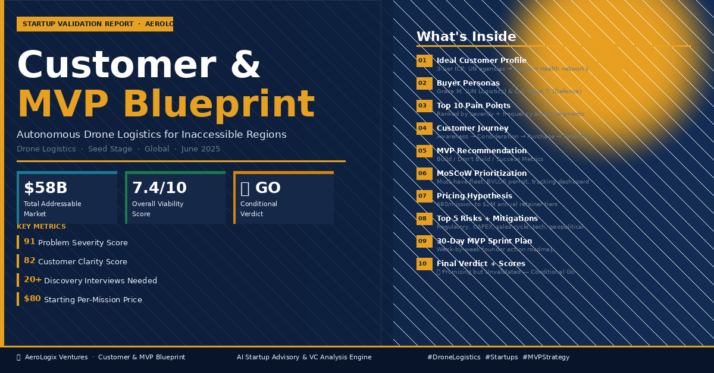

🚀 Day 23 of #60DaysClaudeAIChallenge

🚁 I just ran a full Customer & MVP Blueprint on AeroLogix Ventures — a drone logistics startup delivering medicine, food & emergency supplies to regions unreachable by road.
Here's what the analysis revealed:
The Problem is Massive & Proven
→ ~1 billion people live more than 2 hours from a health facility
→ Last-mile delivery = 60–80% of total humanitarian aid cost
→ Zipline already raised $450M proving this market exists
But the Opportunity Gap is Even Bigger
No single operator today covers medical + food + disaster relief simultaneously. The well-funded players (Zipline, Wing) are optimising for affluent, regulatory-friendly markets. Developing-world, multi-crisis delivery is wide open.
The Blueprint covered:
✅ 3-tier Ideal Customer Profile (UN agencies → Governments → Health networks)
✅ Buyer personas for Grace M. (UN Logistics Head) & Col. Arjun T. (Defence Ministry)
✅ Top 10 pain points ranked by severity — physical inaccessibility & time delay both scored 10/10
✅ Full customer journey from crisis awareness → contract renewal
✅ MoSCoW prioritization — lease drones first, don't build custom hardware yet
✅ Pricing hypothesis: $80/mission (vs $1,200–$4,000 helicopter) up to $2M annual retainer
✅ Top 5 risks with mitigation strategies
✅ A 30-day founder sprint to get to first LOI
The Verdict: 🟡 Promising but Unvalidated
Viability Score: 7.4 / 10
The demand signal is strong. The mission is urgent. But zero customer interviews = zero validation.
The minimum bar before raising Seed:
→ 20+ discovery interviews with NGO logistics officers
→ 1 signed Letter of Intent from a government or UN agency
The biggest insight? The most defensible position in this space isn't competing with Zipline — it's serving the markets Zipline has deliberately ignored.
Would love to hear from anyone working in humanitarian logistics, drone regulation, or impact investing. 👇

Anil Bajpai | ABTalksOnAI | Anthropic 

#60DayClaudeChallenge #ClaudeChallenge #ABTalks #ClaudeAI #ArtificialIntelligence #PromptEngineering #LearningInPublic #BuildInPublic #Productivity #AI #FutureOfWork
#DroneLogistics #StartupStrategy #CustomerDiscovery #MVPBlueprint #HumanitarianTech #VentureCapital #ImpactInvesting #Drones #Startups #ProductStrategy

Screenshot 

