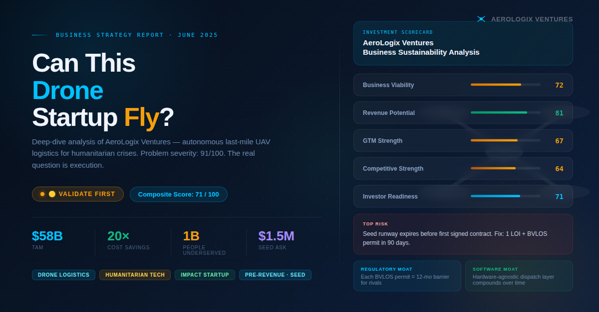

🚀 Day 24 of #60DaysClaudeAIChallenge

🚁 I just ran a full AI co-founder analysis on AeroLogix Ventures — a drone logistics startup targeting humanitarian crises.
Here's the 60-second verdict:
✅ Problem severity: 91/100. ~1 billion people live 2+ hours from a health facility. Last-mile aid delivery = 60–80% of total humanitarian logistics cost.
✅ The economics work. $80–$150 per drone mission vs. $1,200–$4,000 by helicopter. Zipline already proved this model at scale in Rwanda.
⚠️ The risk is execution, not the idea. Seed runway vs. 18-month NGO procurement cycles is the core tension most drone logistics startups don't survive.
🟡 Verdict: Validate First (Composite Score: 71/100)
The path to 🟢 Investable is clear — 1 LOI + BVLOS permit in Rwanda within 90 days.
The full report covers:
→ Business Model Canvas
→ Revenue & Pricing Strategy
→ Go-To-Market (5-phase wedge model)
→ Competitive Moat Analysis
→ Reverse SWOT
→ Founder Action Sheet (10 actions, Day 1 → Week 4)
Drop a comment if you're working in drone logistics, humanitarian tech, or impact investing — would love to connect.

Anil Bajpai | ABTalksOnAI | Anthropic 

#60DayClaudeChallenge #ClaudeChallenge #ABTalks #ClaudeAI #ArtificialIntelligence #PromptEngineering #LearningInPublic #BuildInPublic #Productivity #AI #FutureOfWork
#DroneLogistics #HumanitarianTech #StartupStrategy #ImpactInvesting #UAV #VentureCapital #StartupAnalysis

Screenshot 

