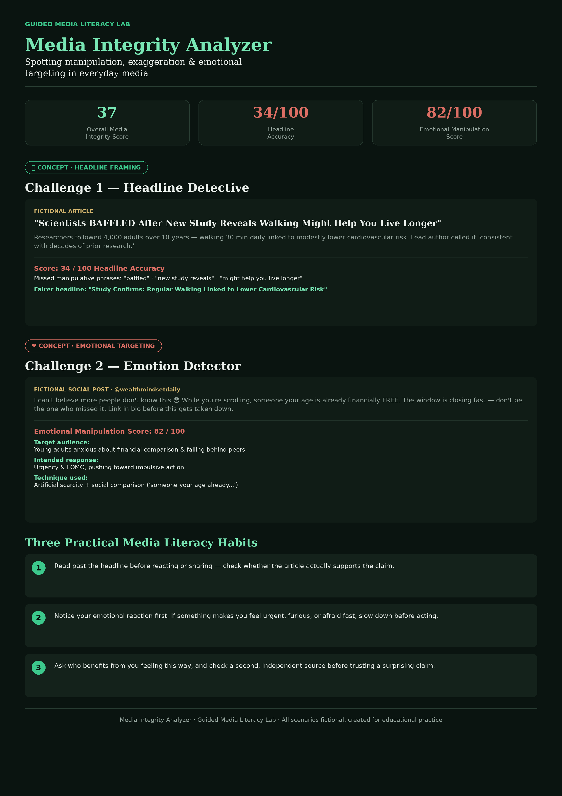

🚀 Day 33 of #60DaysClaudeAIChallenge

Most of what we scroll past every day is engineered to make us feel before we think.
I ran through a "Media Integrity Analyzer" exercise this week — a hands-on lab that scores headlines and social posts on manipulation, emotional targeting, and accuracy rather than just lecturing about media literacy.
A few things that stuck with me:
📰 A headline calling scientists "baffled" by a walking study scored just 34/100 on accuracy — the actual finding was a modest, well-established result dressed up as a shocking discovery.
❤️ A finance "reel caption" using urgency, scarcity, and social comparison ("someone your age is already financially FREE...") scored 82/100 on emotional manipulation — a textbook FOMO trigger.
The pattern is always the same: attention is worth money, and strong emotion is the cheapest way to earn it.
Three habits I'm taking away:
1️⃣ Read past the headline before reacting or sharing.
2️⃣ Notice your emotional reaction first — urgency, anger, or fear is a signal to slow down, not speed up.
3️⃣ Ask who benefits from you feeling this way, then check a second, independent source.
Media literacy isn't about cynicism — it's about pausing just long enough to think clearly.

Anil Bajpai | ABTalksOnAI | Anthropic 

#60DayClaudeChallenge #ClaudeChallenge #ABTalks #ClaudeAI #ArtificialIntelligence #PromptEngineering #LearningInPublic #BuildInPublic #Productivity #AI #FutureOfWork
#MediaLiteracy #CriticalThinking #DigitalWellbeing #Misinformation #ContinuousLearning

Screenshot 

