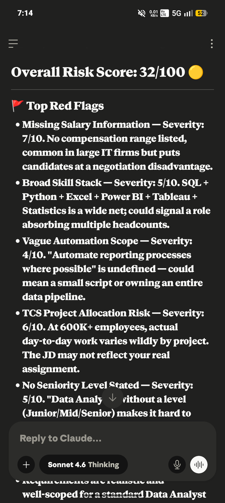
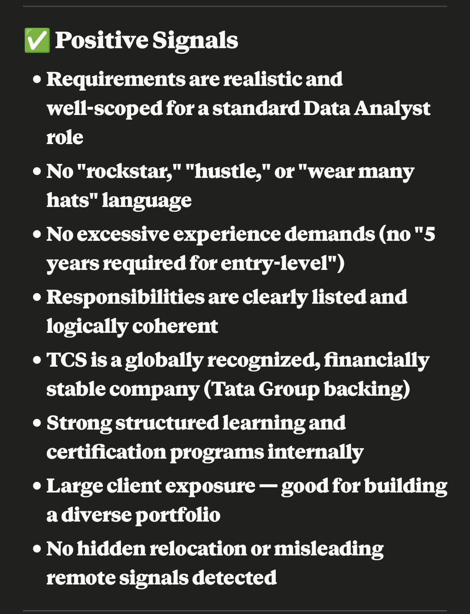
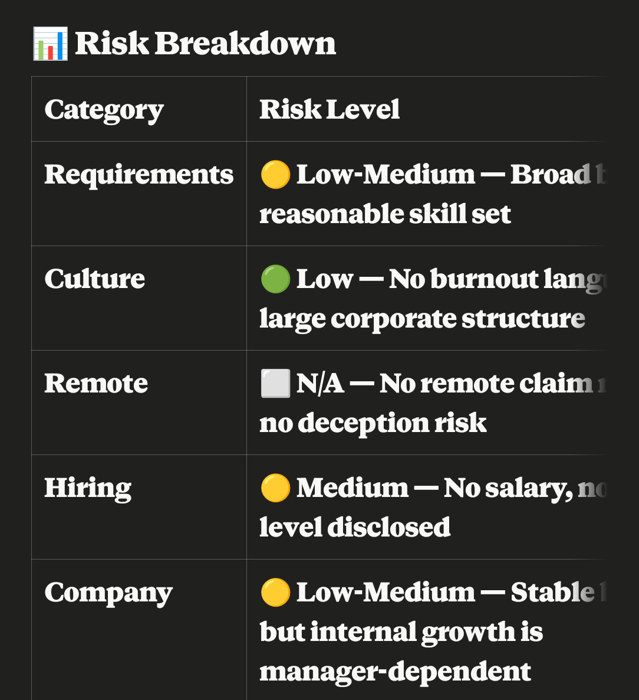
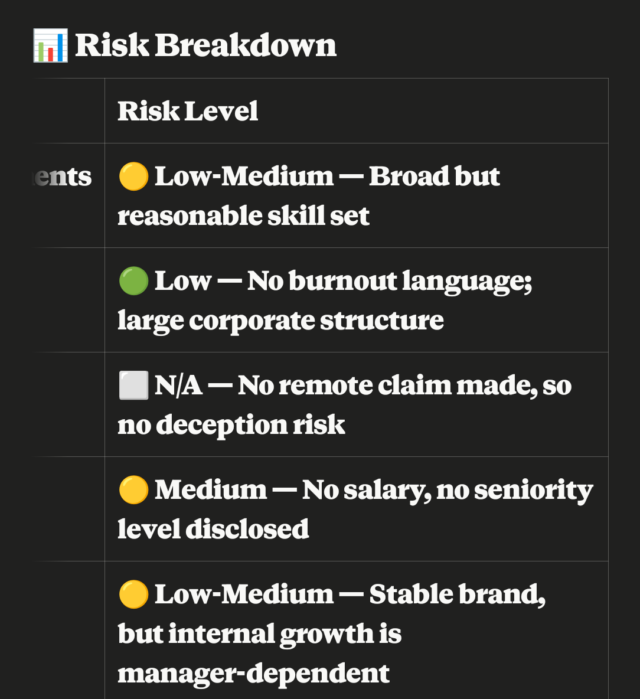
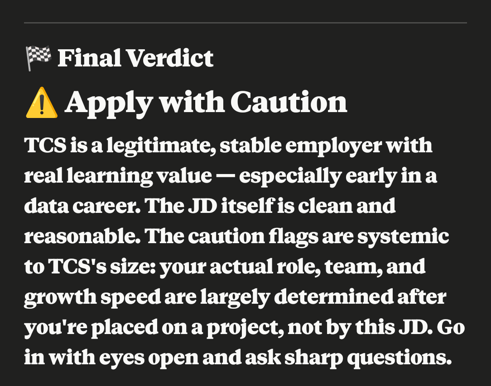

Day 14 

Thinking of applying to TCS as a Data Analyst? Read this first. 👇
I ran a full Red Flag Analysis on a Data Analyst job description from Tata Consultancy Services — and the results might surprise you.
Overall Risk Score: 32/100 ✅ — Lower than you'd expect, but there are still things you need to watch out for.
🚩 What raised flags:
→ No salary range listed — always a negotiation trap
→ Broad skill stack (SQL + Python + Excel + Power BI + Tableau) — are they hiring ONE analyst or THREE?
→ No seniority level mentioned — Junior? Senior? Nobody knows
→ At 600,000+ employees, your actual role depends heavily on which project you land on — not this JD
✅ What actually looked good:
→ Zero "rockstar" or "hustle culture" language
→ Responsibilities are clear and realistic
→ TCS is backed by the Tata Group — financially rock solid
→ Strong internal learning programs and global client exposure
→ No misleading remote work claims
🎯 The real verdict?
TCS is a legitimate company with real growth potential — especially if you're early in your data career.
But here's the truth nobody tells you:
At a company this large, the JD is just the door. The project is your actual job.
Before you accept any offer, ask these:
Which team/client will I actually work with?
How is project allocation decided?
What's the real salary band?
Which tools does THIS team actually use daily?
What does the promotion timeline look like — and who controls it?
The bottom line:
⚠️ Apply — but go in informed, not hopeful.
Do your research. Ask sharp questions. Don't let a big brand name switch off your critical thinking.
💡 I analyze job descriptions for hidden red flags so you don't waste time on the wrong opportunities.
Would you like me to review a JD you're considering? Drop it in the comments or DM me. 👇
@AnilBajpai @ABTalksonAI @Anthropic
Anthropic Anil Bajpai ABTalksOnAI
#60DayClaudeChallenge #ClaudeChallenge #ABTalks #ClaudeAI #ArtificialIntelligence #PromptEngineering #LearningInPublic #BuildInPublic #Productivity #AI #FutureOfWork

Screenshot 

