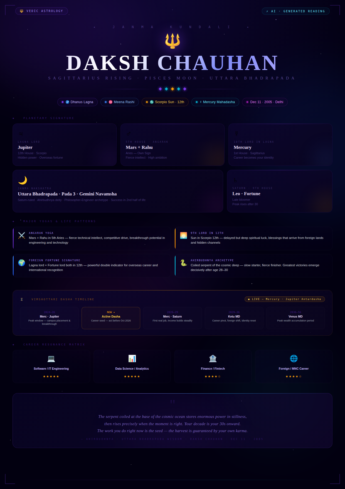

Day 15🚀

🔱 I used Claude  AI to generate a full Vedic Astrology reading of my birth chart — here's what came out.
Born: Dec 11, 2005 · 7:46 AM · Delhi
Lagna: Sagittarius | Moon: Pisces | Sun: Scorpio
Nakshatra: Uttara Bhadrapada (Saturn-ruled)
Key highlights from the reading:
→ Angarak Yoga (Mars + Rahu in 5th) → high aptitude for tech, data & engineering
→ 10th Lord Mercury in Lagna → "career becomes identity"
→ Jupiter + Sun both in 12th House → foreign opportunity strongly favored
→ Venus Mahadasha (2036–56) → peak wealth period predicted in my 30s
What's wild is how a system developed thousands of years ago in India maps so precisely onto modern career paths like software engineering and data science.
Astrology or not — it's a fascinating lens for self-reflection.
Drop your Moon sign below 👇 curious what everyone gets!

@AnilBajpai @ABTalksonAI @Anthropic

Anthropic Anil Bajpai ABTalksOnAI
#60DayClaudeChallenge #ClaudeChallenge #ABTalks #ClaudeAI #ArtificialIntelligence #PromptEngineering #LearningInPublic #BuildInPublic #Productivity #AI #FutureOfWork

