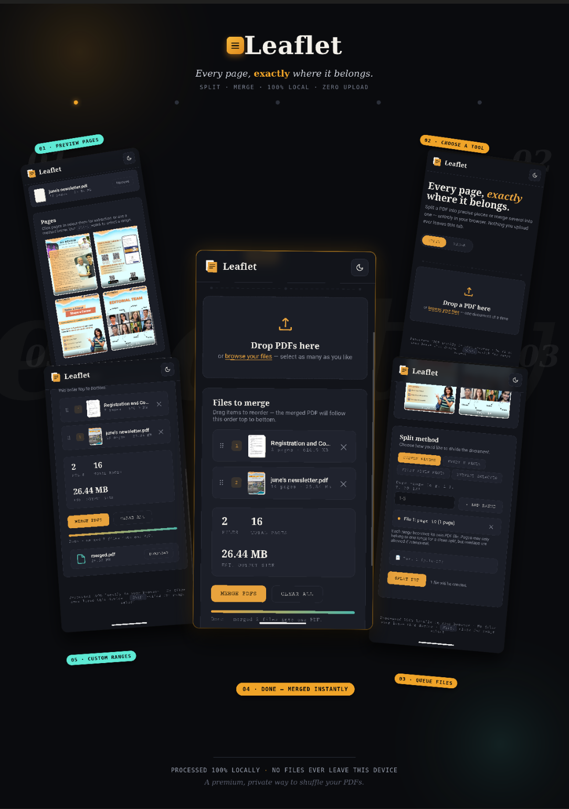

🚀 Day 39/60 of #60DayClaudeAIChallenge

Today I designed a **PDF Splitter & Merger** web application that brings professional document management capabilities directly into the browser.

✨ Key Features:
📄 PDF Splitter with page thumbnails and live previews
✂️ Split by page numbers, custom ranges, specific pages, or every N pages
📑 Extract selected pages into separate PDF files
🔍 Input validation with real-time feedback
📚 PDF Merger with drag-and-drop uploads
↕️ Reorder files before merging
📊 Total file count, page count, and output estimation
💻 100% client-side processing for enhanced privacy
🌙 Dark Mode support
📱 Fully responsive design
♿ Accessibility-focused user experience
⚡ Smooth animations, micro-interactions, and loading states

This project helped me explore:
• Advanced UI/UX Design
• Client-Side PDF Processing
• JavaScript Application Architecture
• Accessibility Best Practices
• Interactive Document Management Workflows

Building products is not just about writing code—it's about creating experiences that are intuitive, efficient, and enjoyable for users.

Screenshot

