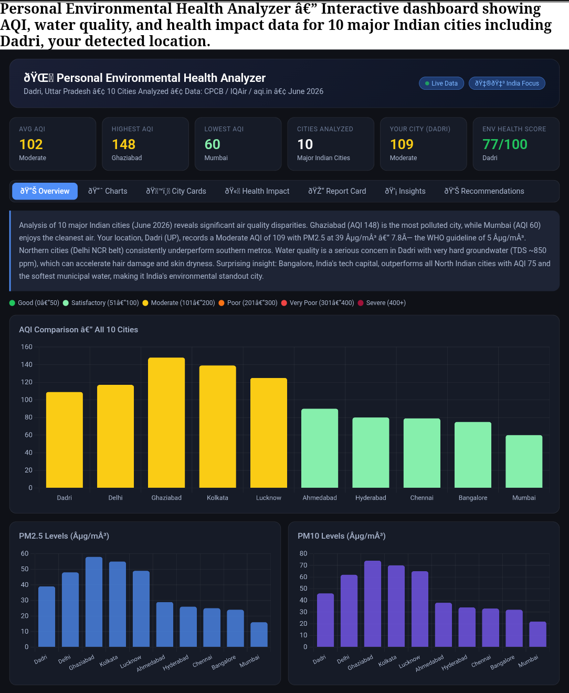
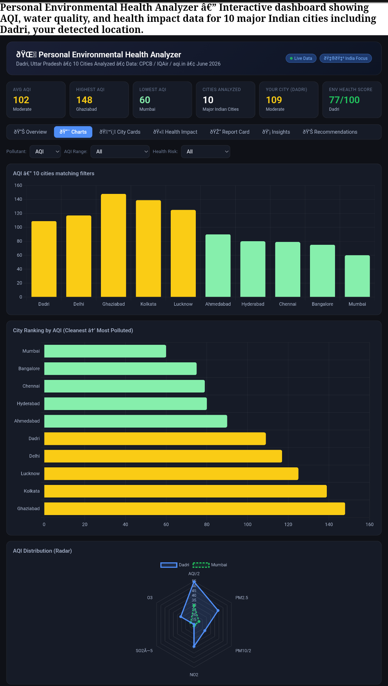
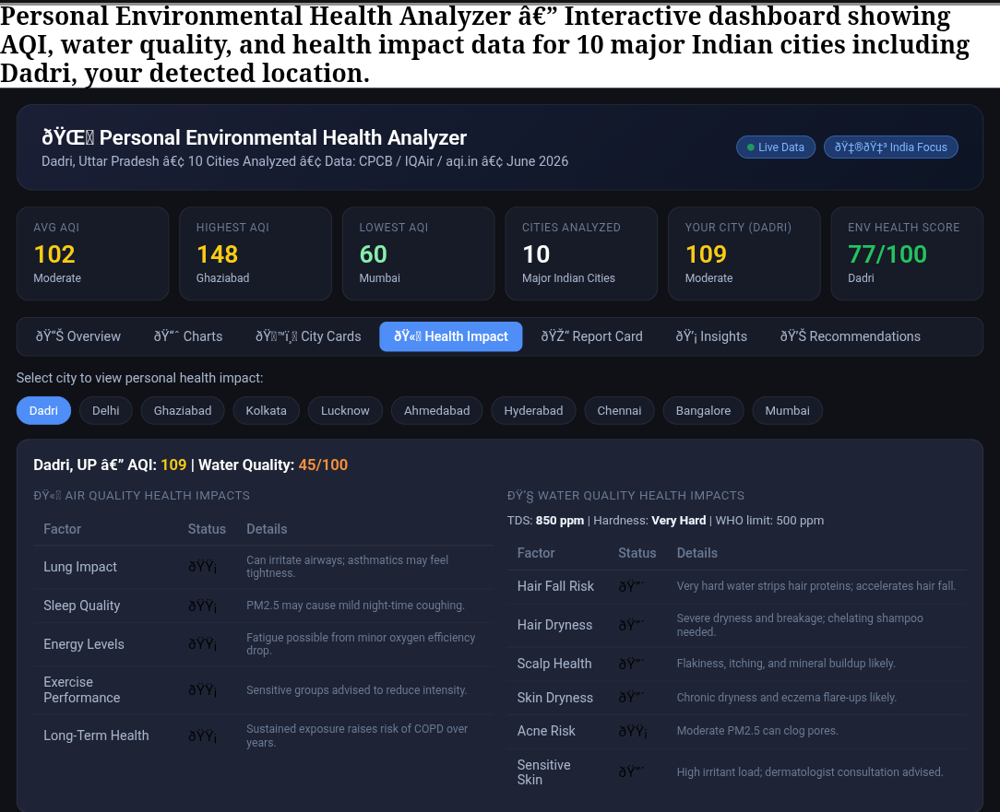

Day 8 – Personal Environmental Health Analyzer 🌍 | #60DayClaudeAIChallenge

Today, I built a Personal Environmental Health Analyzer using advanced prompt engineering with Claude AI.

Project Highlights
Automated AQI and water-quality data integration
Environmental Health Score (0–100) calculation
Interactive dashboards with charts and filters
AQI, PM2.5, and PM10 comparative analysis
City ranking and environmental insights panel
Personal report cards with A–F grading system
Health impact analysis for lungs, sleep, energy, skin, and hair
Personalized recommendations based on environmental conditions
Modern dark-themed, responsive dashboard design
Key Learnings

✅ Data cleaning and validation for environmental datasets
✅ Building health-focused analytics dashboards
✅ Designing interactive visualizations and KPI cards
✅ Creating scoring frameworks for environmental assessment
✅ Converting complex environmental data into actionable insights
✅ Enhancing UX with filters, comparisons, and report cards
✅ Using AI to accelerate dashboard planning and feature development

Screenshot 

HTML file

Outcome

Developed a comprehensive concept for an end-to-end environmental intelligence platform that combines data analytics, health insights, and interactive visualization into a single user-friendly experience.
