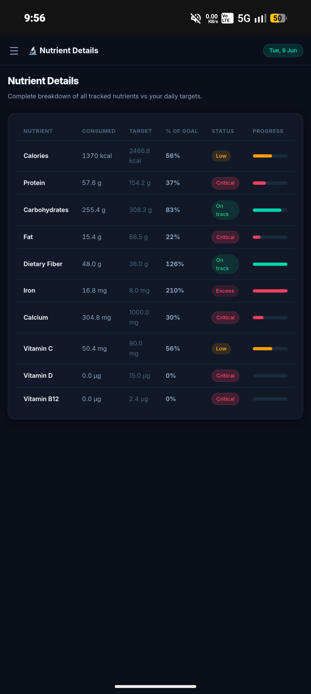
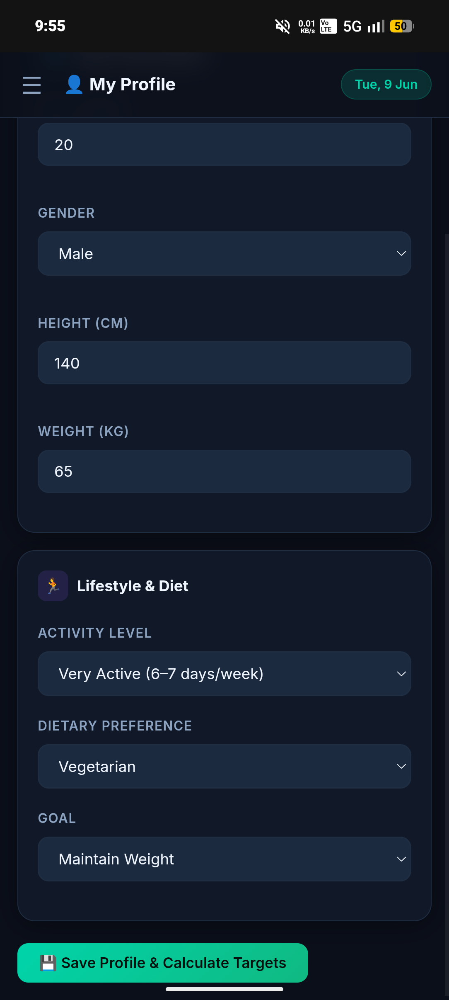
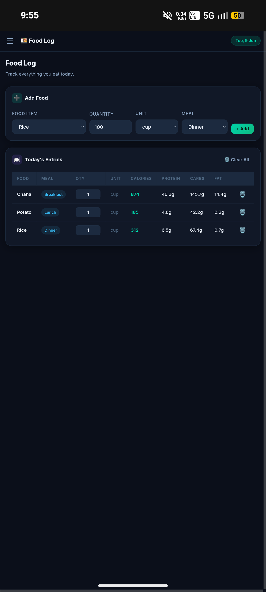
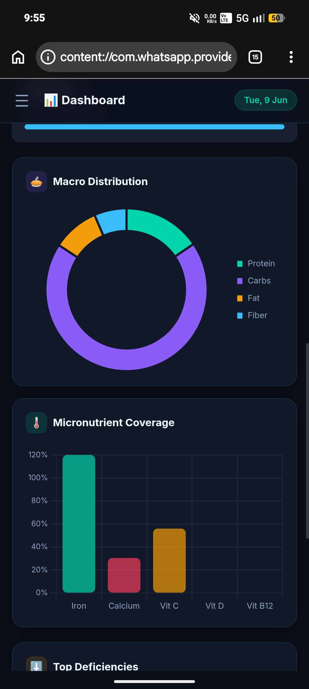
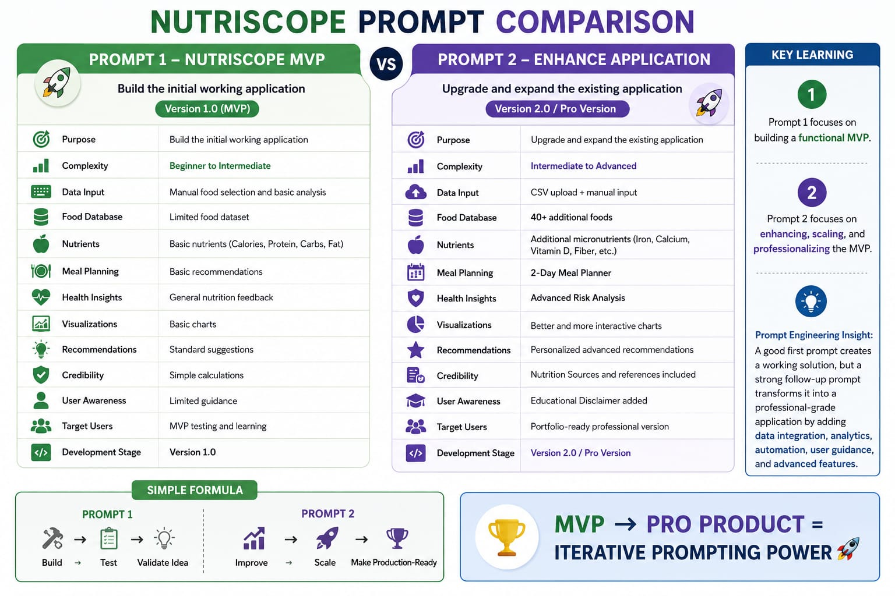
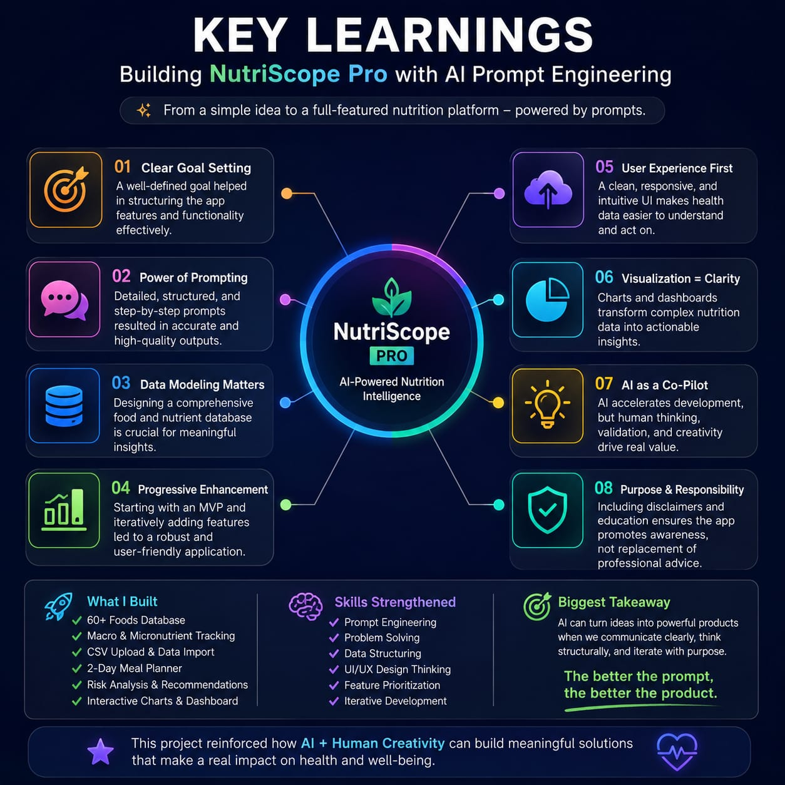

NutriScope Pro – AI-Powered Nutrition Analytics Dashboard
Overview

NutriScope Pro is a nutrition analytics and meal-planning application built through iterative prompt engineering. The project demonstrates how structured AI prompting can transform a simple MVP into a feature-rich health and nutrition platform.

Features
User Profile Management
Food Logging System
CSV Data Upload
60+ Food Database
Macro Nutrient Tracking
Micro Nutrient Monitoring
Interactive Dashboard & Charts
2-Day Meal Planner
Nutritional Risk Analysis
Smart Food Recommendations
Educational Nutrition Disclaimer
Responsive SaaS-Style Interface
Key Learnings
Effective prompt engineering significantly improves application quality.
Breaking large requirements into smaller enhancement stages produces better outcomes.
Data modeling is critical for meaningful nutritional insights.
User-centric design enhances usability and engagement.
Visualization helps convert complex nutritional data into actionable insights.
AI can accelerate prototyping, but human validation remains essential.
Skills Applied
Prompt Engineering
Product Thinking
Dashboard Design
Data Modeling
UI/UX Design
Frontend Development
Feature Prioritization
Iterative Development
Tech Stack
HTML
CSS
JavaScript
Chart.js
Project Outcome

This project showcases how AI-assisted development can rapidly generate and enhance functional applications while reinforcing the importance of clear requirements, structured prompts, and continuous iteration.

Images

profile

dashboard 

food log

nutrients details 

recommendation 

difference of prompt A & promot B

Key Learnings

nutri_scope.html

Biggest Takeaway

The better the prompt, the better the product.

AI is most powerful when combined with human creativity, critical thinking, and domain knowledge.
