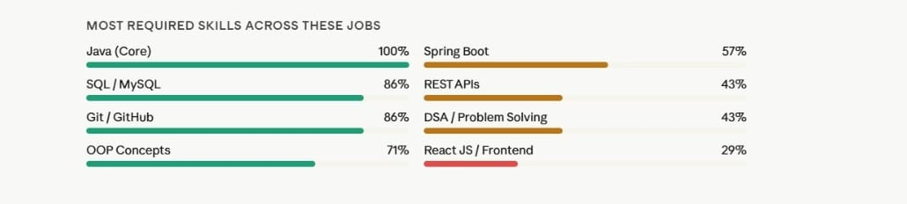
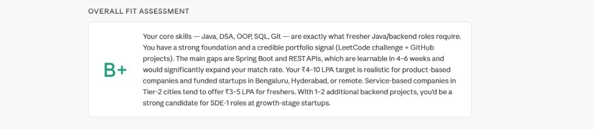
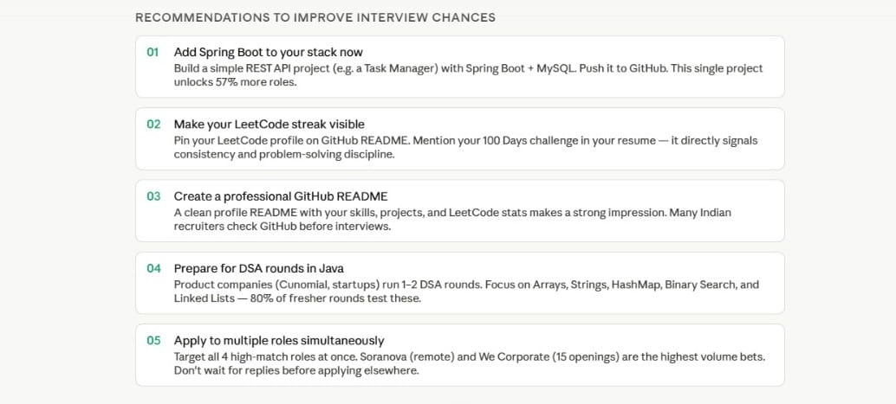
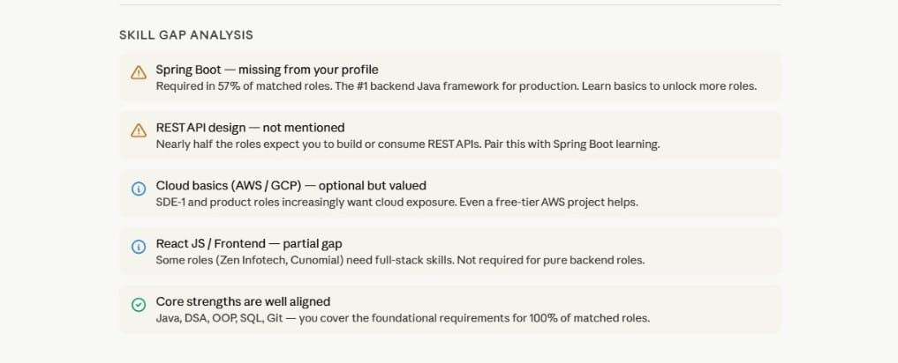
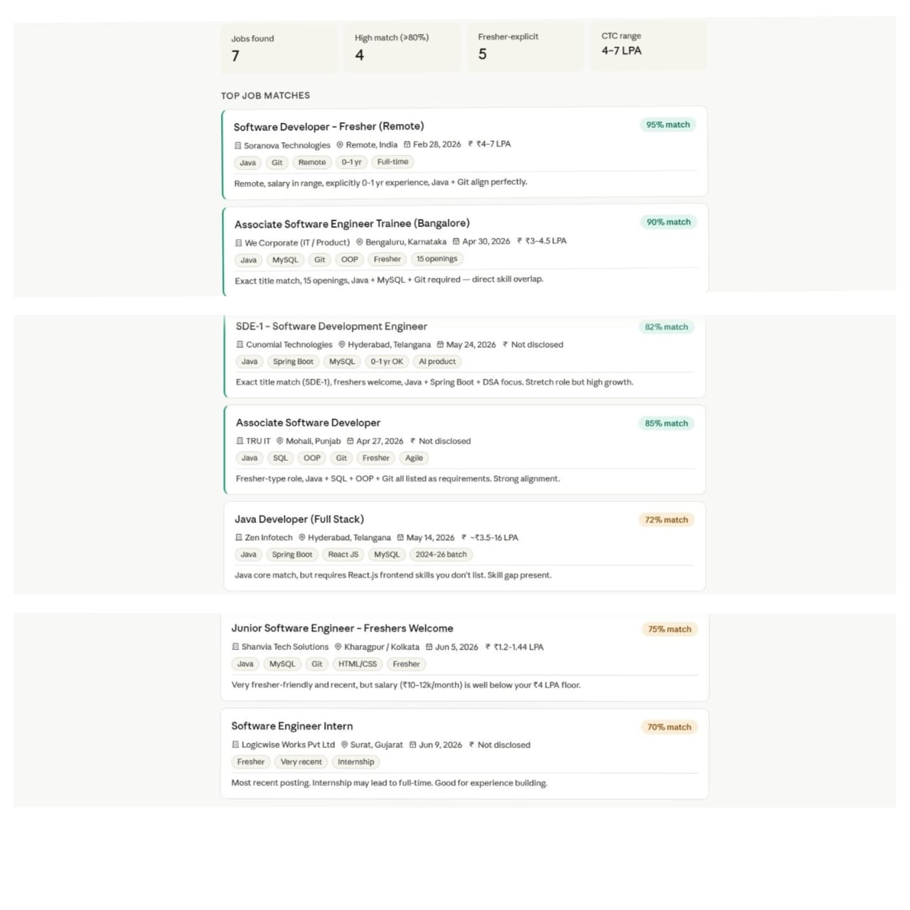

🚀 AI-Powered Resume & Job Match Analysis: My Current Software Engineering Career Snapshot
I recently used AI to analyze my resume against multiple Software Developer and SDE-1 opportunities. The results provided valuable insights into my strengths, skill gaps, and areas of improvement.
📊 Key Findings ✅ Strong foundation in:
Java
Data Structures & Algorithms
OOP Concepts
SQL/MySQL
Git & GitHub
📈 Skills that can significantly increase opportunities
Spring Boot
REST API Development
Cloud Fundamentals (AWS/GCP)
React.js (for full-stack roles)
🎯 Career Match Summary
Overall Fit Assessment: B+
High-match opportunities identified
Target salary range aligned with entry-level Software Engineering roles
Clear roadmap to improve interview success rate
💡 Biggest Learning Sometimes the gap between where you are and where you want to be is just a few focused skills away. For me, mastering Spring Boot and building production-ready backend projects can unlock many more opportunities.
🛠️ Next Steps
Build Spring Boot + MySQL projects
Create REST APIs
Continue DSA practice
Strengthen GitHub portfolio
Apply consistently to relevant SDE roles
Every analysis like this helps transform uncertainty into a clear action plan.

Screenshots 

#SoftwareEngineering #JavaDeveloper #SpringBoot #BackendDevelopment #DSA #GitHub #Programming #CareerGrowth #LearningInPublic #TechCareer #Freshers #SoftwareDeveloper #SDE #Java #LinkedInLearning #CareerDevelopment #OpenToWork #TechCommunity
